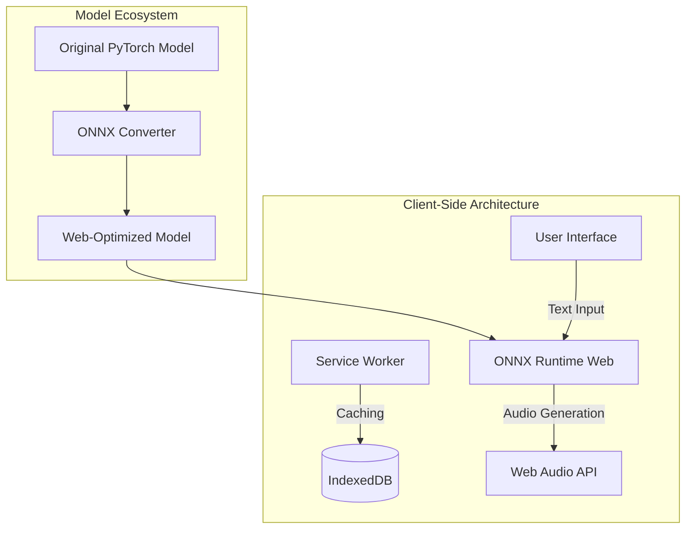

# ZonosTTS Architecture

## Overview
This document provides a comprehensive overview of the ZonosTTS project architecture, focusing on the Progressive Web App (PWA) and mobile client-side implementation.

## System Architecture Diagram

## Key Components

### 1. User Interface
- Responsive design
- Offline-first approach
- Minimal and intuitive controls

### 2. Model Inference
- Client-side model execution
- ONNX Runtime Web
- Optimized for web performance

### 3. Service Worker
- Offline caching
- Background synchronization
- Performance optimization

### 4. Local Storage
- IndexedDB for persistent storage
- Caching generated audio
- Storing user preferences

## Performance Considerations
- Lazy loading
- Code splitting
- Minimal initial bundle size

## Security Measures
- HTTPS
- No server-side data processing
- Local-only audio generation

## Scalability
- Modular architecture
- Easy component replacement
- Extensible design

## Versioning
- Semantic versioning
- Continuous integration
- Automated testing

## Future Roadmap
- WebAssembly optimization
- Advanced caching strategies
- Expanded model support
