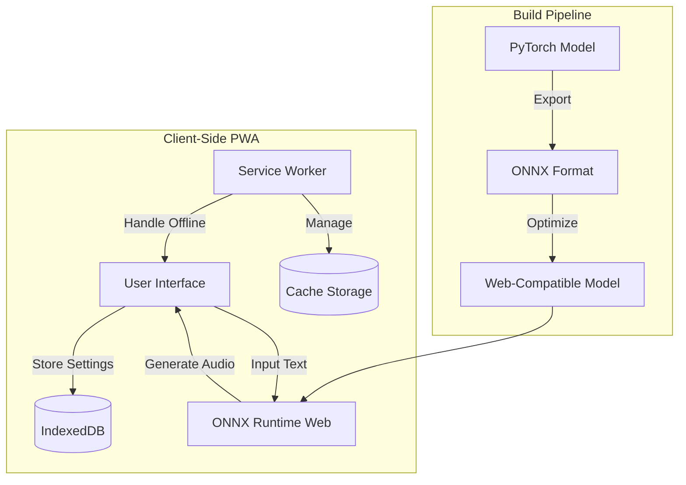
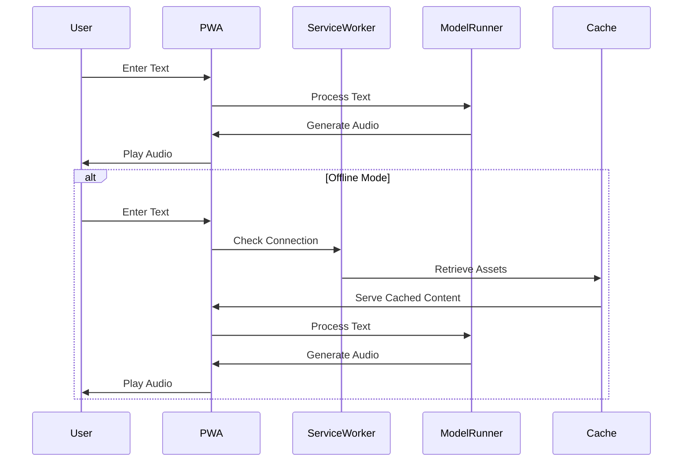
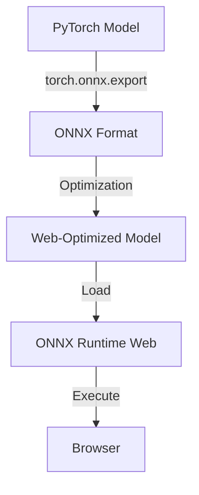
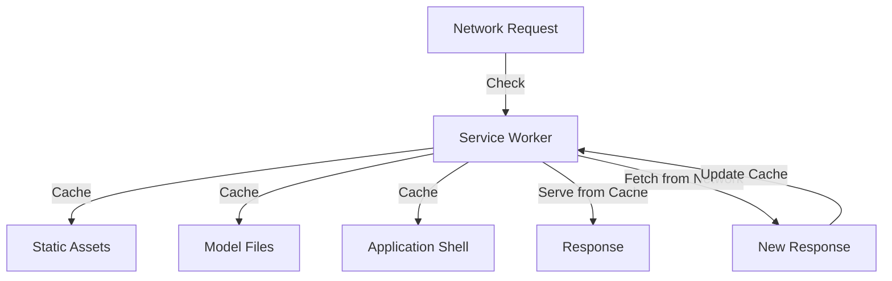
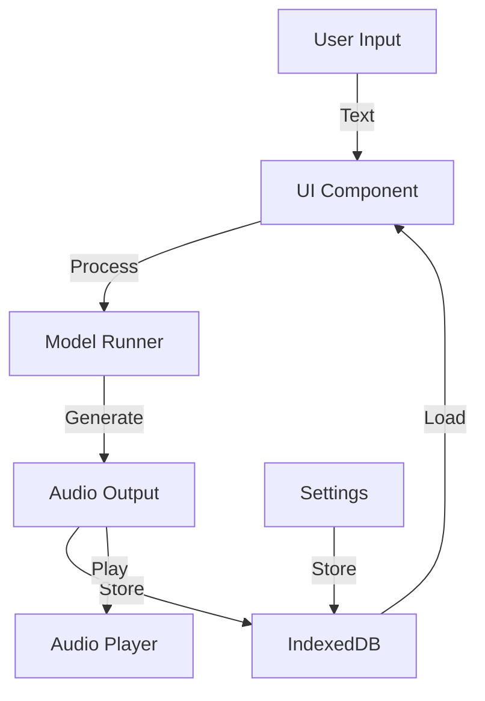
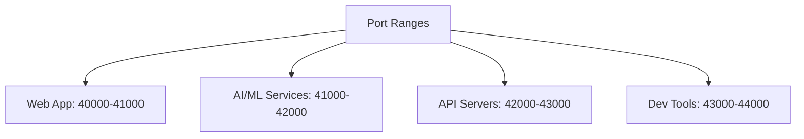

<!-- START: Generated by Cascade (Codeium/Windsurf) on 2025-02-16T03:17:32-05:00 -->

# ZonosTTS PWA Migration Plan

## Overview

This document outlines the plan to migrate the ZonosTTS project from a Gradio-based web interface to a Progressive Web App (PWA) with offline capabilities and client-side rendering.

## Architecture Diagram



## Component Flow



## Checklist

### I. Project Setup and Documentation

- [ ] 1. Review and Update Documentation
  - [ ] Review existing README.md
  - [ ] Review LICENSE
  - [ ] Review CONDITIONING_README.md
  - [ ] Create new documentation files:
    - [ ] ARCHITECTURE.md
    - [ ] IDOLOGIES.md
    - [ ] CONVENTIONS.md
    - [ ] CHANGELOG.md
    - [ ] TODO.md
    - [ ] CONTRIBUTING.md
    - [ ] DIAGRAMS.md

### II. Technology Stack Selection

- [ ] 1. Frontend Framework Selection
  ```mermaid
  graph LR
    A[Framework Options] --> B[React]
    A --> C[Vue.js]
    A --> D[Angular]
    B --> E[Next.js]
    C --> F[Nuxt.js]
    D --> G[Universal]
  ```

- [ ] 2. State Management
  ```mermaid
  graph LR
    A[State Management] --> B[Redux]
    A --> C[Zustand]
    A --> D[Vuex]
  ```

- [ ] 3. Model Execution Strategy
  ```mermaid
  graph TB
    A[PyTorch Model] --> B[ONNX Format]
    B --> C[ONNX Runtime Web]
    C --> D[Browser Execution]
  ```

### III. Core Functionality Implementation

- [ ] 1. Replace gradio_interface.py
- [ ] 2. Implement UI Components
- [ ] 3. Integrate ONNX Runtime Web
- [ ] 4. Implement Service Workers
- [ ] 5. Implement Offline Storage
- [ ] 6. Performance Optimization
- [ ] 7. Error Handling

### IV. PWA Features Implementation

- [ ] 1. Create manifest.json
- [ ] 2. Service Worker Registration
- [ ] 3. HTTPS Setup
- [ ] 4. Push Notifications (Optional)
- [ ] 5. Background Sync (Optional)

### V. Optimization and Testing

- [ ] 1. Device Optimization
- [ ] 2. Browser Testing
- [ ] 3. Performance Testing
- [ ] 4. Code Splitting
- [ ] 5. Asset Optimization

### VI. Documentation and Version Control

- [ ] 1. Update Documentation
- [ ] 2. Git Repository Management
- [ ] 3. Knowledge Graph Updates

### VII. Hybrid Knowledge Graph Coordination

- [ ] 1. Pre-task Graph Check
- [ ] 2. Change Documentation
- [ ] 3. Regular Synchronization

## Technical Details

### Model Conversion Process



### Service Worker Strategy



### Data Flow



## Port Configuration

Following the port range convention from MEMORIES:



For this project, we will use port 40001 for the web application.

## Progress Tracking

Current Status: Initial Planning Phase
Next Steps: Begin technology stack implementation

<!-- END: Generated by Cascade (Codeium/Windsurf) on 2025-02-16T03:17:32-05:00 -->
